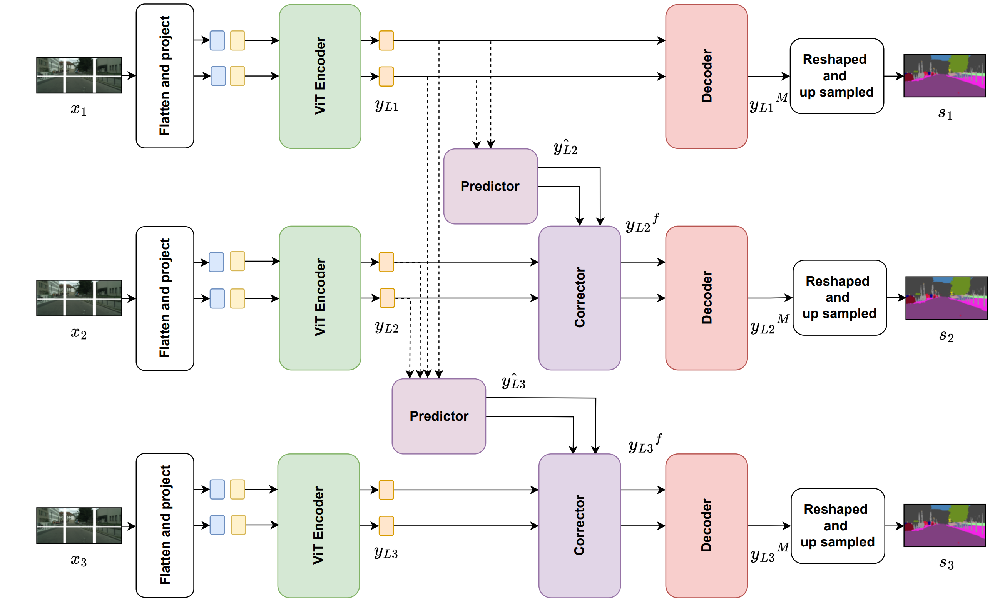

## RecursiveTransformerBasedVideoSegmentation
Task: Video Semantic Segmentation.
Extend the paper that introduced [Segmenter](https://arxiv.org/abs/2105.05633) to also work well for Video data. 

Essentially, a model that handles temporal relations well using transformers.

An overview of the model is given below - 

  

In order to create the required environment:
Use the File requirements.txt. 

This code base is developed on top of the existing Segmenters repository:

https://github.com/rstrudel/segmenter/tree/master
